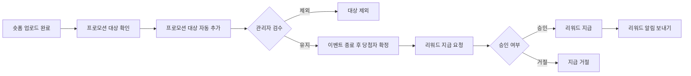
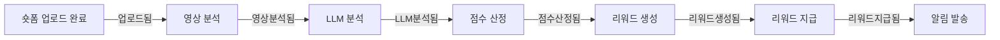

숏폼의 플라이휠을 봤을 때, 추천이 잘 되어서 유저의 소비까지 이루어지게 하려면 일단 영상 수급부터 채워야 한다고 생각했다. 영상이 많아야 시청자에게 더 다양한 콘텐츠를 보여줄 수 있고, 시청이 늘어나면 창작자에게 보상을 줄 수 있고, 보상이 있으면 다시 영상을 올리게 된다. 이 플라이휠을 만드는 것이 목표였다.

내가 숏폼팀에 합류했을 때는 아직 서비스 런칭도 하기 전이었다. 팀에 합류해서 주로 챙기게 된 부분은 콘텐츠 생산에 대한 것이었고, 생산을 충분히 끌어올리기 위한 다양한 시도를 했다. 그중 크리에이터에게 즉각적인 업로드 보상을 해주는 것이 가장 직접적이고 효과적이라고 판단했다.

이 글은 그 보상 시스템이 고정 금액 일괄 지급에서 시작해, 영상 분석 기반 즉시 차등 지급으로 진화하고, 이벤트 드리븐 아키텍처의 한계를 거쳐 워크플로우 오케스트레이션 엔진인 Temporal을 도입하기까지의 과정을 정리한 글이다.

---

## 고정 금액 일괄 지급

처음 설계한 보상 시스템은 단순했다. 특정 기간 동안 업로드한 크리에이터에게 영상 개당 200원의 고정 금액을 지급하는 방식이었다. 이벤트가 종료된 후 한 번에 일괄 지급하는 구조로, 관리자가 모든 영상을 검수하고 부적절한 대상을 제외할 수 있었다.

전체 플로우는 다음과 같았다.




---

## 왜 이벤트 드리븐이었나

보상 시스템을 즉시 지급 방식으로 전환하면서, 업로드 이후의 프로세스를 어떻게 처리할지 고민했다. 동기 방식과 이벤트 기반 방식 사이에서 각각의 장단점을 따져봤다.

동기 방식은 단순하다. 업로드 요청 안에서 (또는 새로운 요청으로) 검수, 점수 산정, 리워드 지급까지 한 번에 처리하면 된다. 흐름이 직관적이고 디버깅도 쉽다. 하지만 우리 프로세스에는 영상 분석, LLM 호출, 점수 계산, 결제 요청과 같은 다양한 or 무거운 로직이 포함되어 있었다. 이걸 업로드 플로우에 묶어버리면 사용자는 업로드할 때마다 긴 로딩을 감수해야 하고, 분석 로직중 하나가 실패하면 그에 따른 처리를 하거나 재시도를 관리할 필요가 생겼다. 트래픽이 몰리는 시점에는 더 치명적이다.

이벤트 기반 방식은 각 단계를 분리해서 메시지 브로커를 통해 비동기로 처리한다. 업로드는 업로드대로 빠르게 끝나고, 분석과 지급은 별도로 진행된다. 리워드 시스템이 잠시 내려가도 업로드에는 영향이 없고, 이벤트는 큐에 쌓여 있다가 복구 후 순차 처리된다. 나중에 알림이나 통계 같은 기능을 추가할 때도 기존 로직을 건드리지 않고 컨슈머만 붙이면 된다.

물론 단점도 있었다. 최종 일관성 모델이라 업로드 직후 리워드가 바로 보이지 않을 수 있고, 중간 단계에서 실패했을 때의 보상 처리도 고민이 필요했다. 그래도 우리 프로젝트의 특성상 업로드와 보상 지급이라는 관심사를 분리하고, 추후 확장성을 확보하는 것이 더 중요하다고 판단했다.

---

## 분석 기반 즉시 차등 지급으로의 진화

일괄 지급 대신 업로드하는 즉시 보상을 주면 임팩트가 클 거라고 생각했다. 국내에 영상을 업로드하면 즉시 리워드를 주는 서비스가 없었기 때문에, 크리에이터 입장에서 강력한 동기부여가 될 수 있었다.

다만 즉시 지급에는 리스크가 따른다. 아무 영상이나 올려도 리워드를 주면 저품질 콘텐츠가 쏟아질 수 있다. 그래서 영상을 분석해서 품질에 따라 금액을 차등 산정하는 시스템이 필요했다.

이미 이벤트 기반으로 설계되어 있었기 때문에 분석 로직을 중간에 껴넣는 것이 수월했다. 업로드 이벤트 이후에 분석 단계를 추가하고, 분석이 끝나면 점수 산정 이벤트를 발행하는 식이다. 중간에 실패하더라도 재시도가 가능하고 다른 단계에 영향을 주지 않는다.

분석 파이프라인은 다음과 같이 동작했다.

1.  숏폼 업로드 완료
2.  영상 분석 (비디오 길이, 소리 유무, 영상 움직임 점수)
3.  LLM 분석 (크리에이터가 입력한 설명과 태깅한 장소명을 기반으로 얼마나 상세한 정보를 제공하는지 점수화)
4.  각 항목의 총 점수를 기반으로 금액 산정
5.  리워드 즉시 지급
6.  알림 발송

LLM 모델은 Gemini Flash를 사용했다. 비용이 저렴하면서도 텍스트 분석에는 충분한 성능을 보여줬다. 복잡한 파이프라인을 만들기보다는 점수 항목을 명확하게 정하고, 각 항목의 총합으로 금액을 산정하는 단순한 구조를 택했다.

---

## EDA의 한계

이벤트 드리븐 아키텍처는 전반적으로 잘 동작했다. 하지만 보상 시스템의 복잡도가 올라가면서 설계적으로 더 고민해야 할 지점들이 생겼다.

가장 큰 문제는 워크플로우의 가시성이었다. 이벤트 기반 시스템은 각 단계가 독립적으로 동작하기 때문에, 전체 흐름을 한눈에 파악하기 어렵다. 동료가 이 시스템을 처음 볼 때 이벤트 체인을 따라가며 전체 플로우를 이해하는 데 시간이 걸렸다.

실제 이벤트 체인은 다음과 같았다.



이벤트가 하나씩 꼬리를 물고 이어지는 구조다. 코드상에서는 각 컨슈머가 흩어져 있어서, 어떤 이벤트가 어떤 컨슈머를 트리거하는지 파악하려면 코드를 뒤져야 했다. 디버깅할 때도 마찬가지로, 중간에 실패한 이벤트를 추적하려면 각 단계의 로그를 하나하나 따라가야 했다.

그 외에도 신경 쓸 부분이 많았다. 매 단계마다 멱등성을 보장해야 했고, 실패 시 재시도와 보상 트랜잭션을 직접 구현해야 했다. 이벤트가 중복 발행되거나 순서가 꼬이는 경우에 대한 방어 로직도 필요했다. 이런 것들을 각 컨슈머마다 일일이 챙기다 보니, 비즈니스 로직보다 인프라 코드가 더 많아지는 느낌이었다.

---

## Temporal 도입

2026년에 리워드 시스템을 다시 한번 정리할 필요가 있었다. 즉시 지급뿐만 아니라 성과 기반 지급까지 자동화해야 하는 상황이었고, 기존 EDA 구조를 그대로 가져갈지 새로운 시스템을 도입할지 고민했다. 그러다 Temporal을 POC 하게 되었고, 앞서 겪었던 한계들을 해결할 수 있겠다는 확신이 들어 도입을 결정했다.

### 가시성의 확보

EDA에서 가장 큰 고통이었던 가시성 문제가 Temporal에서는 자연스럽게 해결되었다. Temporal은 Workflow 자체를 하나의 상태 머신으로 관리한다.

별도의 상태 저장용 테이블을 설계할 필요 없이, 실행 중인 Workflow에 직접 Query를 날려 현재 상태를 즉시 확인할 수 있다. Temporal Web UI에서 게시글 ID로 검색하면 "현재 리워드 지급 API가 타임아웃으로 재시도 중"이라는 것을 실시간으로 확인할 수 있다. 모든 이벤트의 발생 시간과 성공/실패 여부가 타임라인으로 남기 때문에, "왜 5분이나 걸렸나?"라는 질문에 "검수 단계에서 4분 30초가 소요됨"이라고 명확히 답할 수 있게 되었다.

### 코드 수준의 Saga 패턴

EDA에서는 `RewardPaymentFailed` 이벤트를 발행하면, 이를 구독하는 모든 서비스가 각자 취소 로직을 수행해야 했다. 흐름이 복잡해질수록 어떤 단계까지 취소해야 하는지 제어하기가 어려웠다.

Temporal은 분산된 서비스를 하나의 코드 흐름 안에서 제어한다. 취소 로직이 여러 서비스의 이벤트 핸들러에 흩어져 있는 것이 아니라, 하나의 Workflow 함수 안에 응집된다.

```
func RewardWorkflow(ctx workflow.Context, data PostData) error {
    var compensationStack []workflow.Activity

    // 1. 영상 분석
    err := workflow.ExecuteActivity(ctx, InspectShortform, data).Get(ctx, nil)
    if err != nil {
        return err
    }

    // 2. LLM 분석
    err = workflow.ExecuteActivity(ctx, LLMAnalyzeDescription, data).Get(ctx, nil)
    if err != nil {
        return err
    }

    // 3. 리워드 생성 (성공 시 취소 로직 예약)
    err = workflow.ExecuteActivity(ctx, CreateReward, data).Get(ctx, nil)
    if err != nil {
        return err
    }
    compensationStack = append(compensationStack, InvalidateReward)

    // 4. 리워드 지급 (실패 시 보상 트랜잭션 역순 실행)
    err = workflow.ExecuteActivity(ctx, PayReward, data).Get(ctx, nil)
    if err != nil {
        for i := len(compensationStack) - 1; i >= 0; i-- {
            workflow.ExecuteActivity(ctx, compensationStack[i], data)
        }
        return err
    }

    return nil
}
```

마치 로컬 트랜잭션을 다루듯 비즈니스 로직을 짤 수 있게 되었다.

### Durable Execution

사실 가장 좋은 해결책은 취소할 일을 만들지 않는 것이다. EDA에서는 네트워크 오류로 리워드 지급 API 호출이 한 번 실패하면, 복잡한 재시도 로직을 직접 짜거나 보상 트랜잭션을 실행해야 했다.

Temporal의 Durable Execution은 이 문제를 근본적으로 해결한다. 리워드 지급 API가 일시적으로 죽었다면, Temporal은 지정된 정책에 따라 성공할 때까지 자동으로 재시도한다. 서버가 재시작되어도 Workflow는 중단된 지점부터 다시 시작된다. 결과적으로 일시적인 오류로 (요청량 급증으로 인한 실패 등) 인한 보상 트랜잭션 실행 횟수가 극적으로 줄었다. 

Temporal을 도입하면서 EDA의 확장성과 비동기 처리의 이점은 그대로 가져가면서, 가시성 부족과 분산 트랜잭션 관리의 어려움을 코드 작성의 영역으로 끌어내릴 수 있었다.

---

## 마무리

이 글은 1년이 넘도록 숏폼 업로드 리워드 시스템을 운영하고 개선하고 모니터링하며 씨름해온 과정을 압축한 것이다. 고정 금액 일괄 지급이라는 단순한 형태에서 시작해, 분석 기반 즉시 차등 지급으로 진화했고, EDA의 한계를 경험한 뒤 Temporal을 도입하기까지 왔다. 현재는 Temporal 워크플로우 오케스트레이션을 도입하여 안정적으로 운영하고 있다.

돌이켜보면 각 단계마다 그때의 요구사항에 맞는 선택이었다고 생각한다. 처음부터 Temporal을 도입했다면 오히려 오버엔지니어링이었을 것이다. EDA가 틀린 선택이었던 것도 아니다. 업로드와 보상이라는 관심사를 분리하고 비동기로 처리한다는 방향 자체는 맞았다. 다만 워크플로우의 복잡도가 올라가면서, 이벤트 체인만으로는 감당하기 어려운 지점이 생겼을 뿐이다.

기술 선택에 정답은 없다고 생각한다. 중요한 건 현재 시스템이 어떤 문제를 겪고 있는지 정확히 인식하고, 그에 맞는 도구를 적시에 도입하는 것이다.
