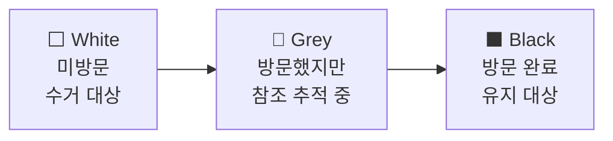
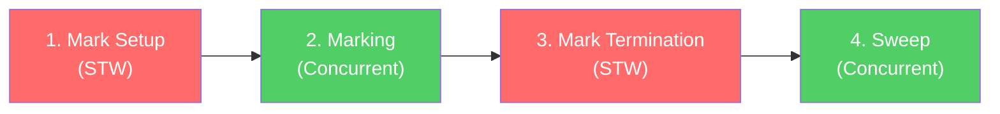

## 들어가며

대부분의 프로그래밍 언어에서 GC는 **양날의검**으로 여겨진다. 메모리를 자동으로 관리해주지만, 그 대가로 프로그램이 예측할 수 없는 순간에 멈추는 Stop-The-World(STW) 현상을 감수해야 한다. Java 세계에서는 GC 일시정지로 인해 API 응답 시간이 튀는 경험을 많이 해봤을 것이다.

Go GC의 최우선 설계 목표는 **낮은 지연 시간(Low Latency)이다**. 처리량(Throughput)을 다소 희생하더라도, 프로그램이 멈추는 시간을 극단적으로 줄여 요청 응답 속도를 보장하겠다는 철학이다(사실 처리량도 매우 우수하다). 실제로 Go 1.8 이후 GC의 STW 시간은 100마이크로초 이하이다.

**Go의 언어적 특성**

Go는 **값 지향(Value-oriented)** 언어다. 구조체를 다른 구조체 안에 포인터 없이 직접 내장(embed)할 수 있고, 슬라이스는 연속된 메모리 블록에 값을 저장한다. Java에서 `ArrayList<Point>` 안의 각 `Point` 객체가 힙의 제각각 다른 위치에 흩어져 있는 것과 달리, Go의 `[]Point`는 메모리상에 연속적으로 배치된다. 이 설계 자체가 GC가 추적해야 하는 포인터 수를 구조적으로 줄여준다.

이 글에서는 Go의 메모리 할당 구조부터 GC 알고리즘, Java와의 비교, 그리고 Go 1.26에서 기본 활성화된 Green Tea GC까지 다룬다.

---

## Go GC의 메모리 할당

GC를 이해하려면 먼저 메모리가 어떻게 할당되는지부터 알아야 한다. Go의 메모리 관리는 "GC가 일어나기도 전에 최대한 GC의 부담을 줄이자"라는 전략 위에 세워져 있다.

### TCMalloc

Go 런타임은 Google의 TCMalloc(Thread-Caching Malloc)에서 영감을 받은 커스텀 메모리 할당자를 사용한다. TCMalloc 그 자체가 아니라, Go의 동시성 모델에 맞게 재설계한 독자적인 구현이다.

할당자는 3계층 구조로 이루어져 있다.

```
mcache (P별 캐시, 락 불필요)
   ↓ 부족하면 요청
mcentral (크기 클래스별 중앙 저장소, 락 필요)
   ↓ 부족하면 요청
mheap (전체 힙 관리, 전역 락)
```

**mcache**는 GMP 모델의 P(논리적 프로세서)마다 하나씩 존재하는 로컬 캐시다. 고루틴이 메모리를 할당할 때 먼저 현재 P의 mcache를 확인한다. P당 하나이므로 동시에 접근하는 고루틴이 없고, 따라서 **락이 필요 없다**. 대부분의 할당은 이 단계에서 끝난다.

mcache가 비면 **mcentral**에서 보충한다. mcentral은 크기 클래스(Size Class)별로 메모리 블록을 관리하는 중앙 저장소다. 여러 P가 동시에 접근할 수 있으므로 락이 필요하지만, 크기 클래스별로 분리되어 있어 경합이 분산된다.

mcentral도 비면 **mheap**에서 새로운 메모리를 할당받는다. mheap은 OS로부터 큰 메모리 영역을 받아와 관리하는 최상위 계층이다.

**크기 클래스(Size Class)는** 이 구조에서 핵심적인 역할을 한다. Go는 객체 크기를 약 70개의 클래스로 분류하고, 같은 크기 클래스의 객체를 하나의 span(연속된 페이지)에 모아서 관리한다.

```bash
                      Span (8KB 페이지)
                 ┌─────────────────────────┐
  24B 클래스     │ 24B │ 24B │ 24B │ ...   │  ← 17B 객체 → 24B 클래스에 할당 (341개 슬롯)
                 └─────────────────────────┘
                 ┌─────────────────────────┐
  112B 클래스    │  112B  │  112B  │ ...   │  ← 100B 객체 → 112B 클래스에 할당 (73개 슬롯)
                 └─────────────────────────┘
                 ┌─────────────────────────┐
  896B 클래스    │    896B    │   896B     │  ← 800B 객체 → 896B 클래스에 할당 (9개 슬롯)
                 └─────────────────────────┘
```

같은 크기의 객체가 같은 span에 모여있으므로, 객체가 해제되면 그 슬롯에 동일 크기의 새 객체가 딱 맞게 들어간다. 빈 슬롯을 재활용하기 쉬워져 **메모리 단편화가 줄어든다**. 단편화가 적으니 Java처럼 객체를 이동시켜 빈 공간을 합치는 압축(Compaction)이 필요 없다.

### Escape Analysis

Go 컴파일러는 변수를 스택에 할당할지 힙에 할당할지 자동으로 결정한다. 이를 **이스케이프 분석(Escape Analysis)이라고** 한다.

```go
func newUser() *User {
    u := User{Name: "harris"} // u는 함수 밖으로 반환되므로 힙에 할당
    return &u
}

func process() {
    u := User{Name: "harris"} // u는 함수 내부에서만 사용되므로 스택에 할당
    fmt.Println(u.Name)
}
```

스택에 할당된 객체는 함수가 반환되면 자동으로 사라진다. GC가 추적하거나 회수할 필요가 없다. 반면 힙에 할당된 객체는 GC가 관리해야 한다. 따라서 **이스케이프 분석은 컴파일 타임에 객체의 scope에 따라 할당하는 메모리 공간을 정할 수 있다.**

`go build -gcflags="-m"` 명령으로 컴파일러의 이스케이프 분석 결과를 직접 확인할 수 있다.

```
$ go build -gcflags="-m" main.go
./main.go:4:2: moved to heap: u    # 힙으로 이동
./main.go:9:2: u does not escape   # 스택에 유지
```

이 결과를 보고 불필요한 힙 할당을 줄이는 것이 가장 기본적인 GC 최적화 방법이다.

이 단계에서 이미 수명이 짧은 임시 객체 상당수가 GC의 레이더에서 벗어난다. Java의 세대별 GC가 런타임에 "젊은 객체는 빨리 죽는다"는 가설을 활용해 최적화하는 것을, Go는 컴파일 타임에 미리 해결해 버리는 셈이다.

---

## Go GC 톺아보기

그럽 실제 힙에 할당된 객체는 어떻게 관리될까?

Go는 **동시 3색 마크 앤 스위프(Concurrent Tri-color Mark and Sweep)** 알고리즘을 사용한다. 이건 다른 언어의 GC와 비슷하게 Mark And Sweep 이다. "살아있는 객체를 찾아 표시하고(Mark), 나머지를 회수한다(Sweep)." 그리고 이 과정을 애플리케이션과 **동시에** 수행한다.

### Tri-color Mark and Sweep

GC는 힙의 모든 객체를 세 가지 색으로 분류한다.



-   **White**: 아직 방문하지 않은 객체. 마킹이 끝난 후에도 White로 남아있으면 수거된다.
-   **Grey**: 방문했지만, 이 객체가 참조하는 다른 객체를 아직 추적하지 않은 상태.
-   **Black**: 방문 완료. 이 객체와 이 객체가 참조하는 모든 객체가 추적되었다.

마킹 과정은 다음과 같다.

1.  처음에 모든 객체는 White다.
2.  GC 루트(스택 변수, 전역 변수)에서 직접 참조하는 객체를 Grey로 변경한다.
3.  Grey 객체를 하나 꺼내 Black으로 변경하고, 이 객체가 참조하는 White 객체를 Grey로 변경한다.
4.  Grey 객체가 없을 때까지 3번을 반복한다.
5.  남은 White 객체는 어디서도 참조되지 않으므로 회수한다.

### GC Cycle

전체 GC 사이클은 4단계로 나뉜다.



**1단계: Mark Setup (STW)**

짧은 STW가 발생한다. 이 시간 동안 쓰기 장벽(Write Barrier)을 활성화하고, 모든 P에게 GC가 시작됨을 알린다. 일반적으로 수십 마이크로초 이내에 완료된다.

**2단계: Marking (Concurrent)**

애플리케이션과 **동시에** 실행되는 핵심 단계다. GC는 `GOMAXPROCS/4`개의 고루틴을 마킹 작업에 할당한다. 예를 들어 `GOMAXPROCS=8`이면 2개의 고루틴이 GC 마킹을 수행하고, 나머지 6개는 애플리케이션 코드를 계속 실행한다. 즉, **CPU의 약 25%를 GC에 사용**한다.

이 단계에서 GC는 루트부터 시작해 도달 가능한 모든 객체를 추적하며 Grey → Black으로 전환한다.

**3단계: Mark Termination (STW)**

다시 짧은 STW가 발생한다. 마킹이 완료되었는지 확인하고, 쓰기 장벽을 비활성화한다. 역시 수십 마이크로초 이내에 끝난다.

**4단계: Sweep (Concurrent)**

백그라운드에서 White로 남은 객체의 메모리를 회수한다. 이 단계도 애플리케이션과 동시에 실행된다. 회수된 메모리는 할당자의 span으로 반환되어 재사용된다.

전체 GC 사이클에서 STW가 발생하는 시점은 1단계와 3단계뿐이며, 각각 수십 마이크로초 수준이다. 나머지 대부분의 시간은 애플리케이션과 동시에 실행된다.

### 쓰기 장벽 (Write Barrier)

GC가 객체를 스캔하는 동안 애플리케이션이 계속 실행된다면, 한 가지 위험한 상황이 발생할 수 있다. GC가 객체 A를 Black으로 표시한 뒤, 애플리케이션이 A에 새로운 포인터를 추가하여 White 객체 C를 가리키게 만드는 것이다. GC는 A를 이미 "조사 완료"로 봤으므로 C를 방문하지 않고, C는 살아있는데도 회수될 위험이 있다.

**쓰기 장벽(Write Barrier)은** 이 문제를 해결한다. GC가 활성화된 동안 포인터를 변경하는 모든 쓰기 연산에 작은 코드 조각이 끼워 넣어진다. 이 코드가 "방금 새로운 참조가 생겼으니, 해당 객체를 Grey로 표시하라"고 GC에게 알리는 것이다.

Go 1.8부터는 **하이브리드 쓰기 장벽**을 사용한다. 이는 두 가지 방식을 결합한 것이다.

-   **Dijkstra 삽입 장벽**: 새로 참조되는 객체를 Grey로 표시한다. → 새 참조를 놓치지 않는다.
-   **Yuasa 삭제 장벽**: 참조가 삭제되는 객체를 Grey로 표시한다. → 기존 참조가 사라져도 추적을 보장한다.

이 하이브리드 방식이 중요한 이유는 **스택 재스캔을 제거**했기 때문이다. Go 1.8 이전에는 마킹 도중 스택의 포인터가 변경되었을 수 있으므로, 마킹이 끝난 후 모든 고루틴의 스택을 다시 한번 스캔해야 했다. 이 재스캔이 STW 시간을 크게 늘리는 원인이었다. 하이브리드 쓰기 장벽 도입 후 최악의 STW가 **50µs 이하**로 줄었다.

### GC 실행 시점

GC를 너무 일찍 시작하면 CPU를 낭비하고, 너무 늦게 시작하면 힙이 목표를 초과한다. **GC Pacer**는 이 균형을 잡는 피드백 제어 알고리즘이다.

Pacer는 다음 공식으로 목표 힙 크기를 계산한다.

```
Target heap = Live heap + (Live heap + GC roots) &times; GOGC / 100
```

예를 들어, 현재 살아있는 객체가 100MB이고 `GOGC=100`(기본값)이면, 힙이 약 200MB에 도달할 때 다음 GC를 시작한다. 하지만 GC는 시작 즉시 완료되는 것이 아니라 마킹에 시간이 걸리므로, Pacer는 그 시간 동안의 추가 할당을 예측해서 실제로는 200MB **이전에** GC를 시작한다.

`GOMEMLIMIT`이 설정된 경우, Pacer는 전체 메모리 한도도 함께 고려하여 GC 시작 시점을 조정한다. Pacer는 뒤에서 다룰 `GOGC`와 `GOMEMLIMIT` 튜닝의 기반이 되는 핵심 메커니즘이다.

---

## JVM vs Go

지금까지 Go GC의 내부 구조를 살펴봤다. 세대를 나누지 않고, 객체를 이동시키지 않으며, 튜닝 파라미터도 두 개뿐이다. 이런 설계가 어떤 트레이드오프를 만들었는지, Java의 GC와 나란히 놓고 보면 더 명확해진다.

### 세대별 GC (약한 세대 가설)

Java의 전통적인 GC(G1 GC 등)는 **약한 세대 가설(Weak Generational Hypothesis)을** 기반으로 한다. "대부분의 객체는 금방 죽는다"는 가설에 따라, 힙을 Young Generation과 Old Generation으로 나누고, 새로 생성된 객체는 Young에 넣어 빠르게 수거한다. Young에서 살아남은 객체만 Old로 승격시킨다.

Go는 세대별 GC를 사용하지 않는다(Non-generational). 그 이유는 두 가지다.

**첫째, 언어 설계가 세대별 GC의 필요성을 줄인다.** Go는 값 타입을 기본으로 하고, 클래스 계층이 없으며, 구조체를 다른 구조체에 인라이닝할 수 있다. 이런 특성 덕분에 이스케이프 분석의 효과가 극대화되어, 수명이 짧은 객체는 대부분 스택에서 처리된다. 힙에 도달하는 단명 객체가 적으니 Young Generation을 따로 둘 이유가 줄어든다.

참고로 Java도 JDK 6부터 이스케이프 분석을 지원한다. 하지만 Java는 거의 모든 것이 객체 참조(reference)이고 클래스 계층이 깊어질 수 있어, 컴파일러가 객체의 범위를 확정하기 어려운 경우가 많다. 같은 이스케이프 분석이라도 언어 설계에 따라 효과가 다르다.

**둘째, 세대 간 포인터 추적의 오버헤드를 피한다.** 세대별 GC는 Old 객체가 Young 객체를 참조하는 경우를 추적하기 위해 별도의 쓰기 장벽(remembered set)이 필요하다. Go는 이 추가적인 복잡성과 런타임 오버헤드를 피하는 쪽을 택했다.

### Compaction

Java GC는 살아남은 객체를 메모리 한쪽으로 모아 빈 공간을 합치는 압축(Compaction)을 수행한다. 이 과정에서 객체의 메모리 주소가 바뀐다.

Go는 객체를 이동시키지 않는다(Non-moving). 크기 클래스 기반 할당으로 단편화를 충분히 관리할 수 있기 때문이다. 객체가 이동하지 않는다는 특성은 C/C++와의 상호운용(CGo)에서도 유리하다. 객체 주소가 변하지 않으므로 포인터를 외부에 안전하게 전달할 수 있다.

| 특성 | Go | Java (G1 GC) |
| --- | --- | --- |
| 세대별 GC | 없음 | 있음 (Young/Old) |
| 압축 | 없음 (Non-moving) | 있음 (Compaction) |
| 주요 알고리즘 | Concurrent Mark & Sweep | Concurrent Mark & Compact |
| STW 목표 | 최소화 (수십 µs) | 조절 가능 (기본 200ms) |
| 설계 철학 | 단순함, 저지연 | 유연함, 고처리량 |

위 비교는 Java의 전통적인 G1 GC 기준이다. 현대 JVM에는 **ZGC**(JDK 15+), **Shenandoah**(JDK 12+) 같은 저지연 GC도 존재하며, 이들도 sub-millisecond STW를 달성한다. 다만 이들은 수십~수백 GB의 대규모 힙에 최적화되어 있고, 튜닝 복잡도가 높다. Go GC의 차별점은 `GOGC`와 `GOMEMLIMIT` 두 개의 노브만으로 대부분의 워크로드에서 잘 동작하는 **단순함**에 있다.

---

## Green Tea GC

지금까지 설명한 GC로도 충분히 잘 동작해왔다. 하지만 하드웨어가 변했다. CPU 코어는 수십~수백 개로 늘었고, 메모리 대역폭은 그에 비례하지 않는다. 기존 GC의 메모리 접근 패턴에 숨어있던 비효율이 현대 하드웨어에서 점점 두드러지기 시작했다. Green Tea GC는 이 문제를 정면으로 다룬다.

### 객체 참조 스캔 → 페이지 참조 스캔

앞서 설명한 마킹 단계를 다시 떠올려보자. Grey 객체를 작업 스택(work buffer)에서 하나 꺼내고, 그 객체의 포인터를 따라가 다음 객체를 방문하고, 또 다음 객체를 방문한다. Go의 기존 GC는 이 작업 스택을 LIFO 방식으로 운영하기 때문에, 본질적으로 **객체 단위의 깊이 우선 그래프 탐색(Depth-First Graph Flood)이다**.

```
기존 GC의 메모리 접근 패턴:

페이지 A의 객체 1 → 페이지 C의 객체 5 → 페이지 A의 객체 3 → 페이지 B의 객체 2
     ↑                    ↑                    ↑                    ↑
   캐시 미스            캐시 미스            캐시 미스            캐시 미스
```

포인터를 따라갈 때마다 힙의 완전히 다른 위치로 점프한다. CPU 캐시에 올려놓은 데이터가 무용지물이 되고, 매번 메인 메모리에서 데이터를 가져와야 한다. 실측 결과, **마킹 시간의 약 35%가 힙 메모리 접근 대기(Memory Stall)에** 소모되고 있었다.

10년 전에는 이것이 큰 문제가 아니었다. 하지만 현대 서버는 수십~수백 개의 코어를 가지고 있고, NUMA(Non-Uniform Memory Access) 아키텍처에서는 원격 메모리 접근이 특히 비싸다. 코어가 많아질수록 메모리 대역폭은 공유 자원이 되고, 비효율적인 메모리 접근 패턴은 확장성의 병목이 된다.

Green Tea GC의 핵심 아이디어는 단순하다. **작업의 단위를 "객체"에서 "페이지"로 바꾼다.**

```
Green Tea GC의 메모리 접근 패턴:

페이지 A: [객체 1] → [객체 2] → [객체 3] → [객체 4]  (순차 스캔, 캐시 적중!)
페이지 B: [객체 5] → [객체 6]                          (순차 스캔, 캐시 적중!)
페이지 C: [객체 7] → [객체 8] → [객체 9]              (순차 스캔, 캐시 적중!)
```

기존 GC가 "이 객체의 포인터를 따라가서 다음 객체를 방문"했다면, Green Tea는 "이 페이지 안의 모든 객체를 먼저 스캔하고, 발견된 포인터가 가리키는 페이지를 작업 큐에 추가"한다. 작업 큐도 LIFO(Depth-First)에서 **FIFO(Breadth-First)로** 변경되어, 같은 페이지를 반복 방문하면서 새로 발견된 객체를 한 번에 처리한다.

한 페이지(8 KiB)의 데이터는 CPU 캐시에 충분히 들어간다. 페이지 내 객체를 순차적으로 스캔하면 캐시 적중률이 극대화되고, 메모리 스톨이 크게 줄어든다.

### 벡터 명령어

Green Tea는 각 페이지의 객체마다 2비트의 메타데이터를 관리한다.

-   **Seen 비트**: 다른 객체의 포인터가 이 객체를 가리킨다는 것을 발견했을 때 설정한다.
-   **Scanned 비트**: 이 객체를 실제로 스캔(내부 포인터 추적)했을 때 설정한다.

두 비트의 차이(`Seen & !Scanned`)로 "발견되었지만 아직 스캔하지 않은 객체"를 효율적으로 식별한다. 기존 GC의 Grey 상태에 해당하지만, 비트맵 연산으로 한 번에 처리할 수 있다는 것이 핵심이다.

Go 1.26에서는 AVX-512의 `VGF2P8AFFINEQB` 명령어를 활용한 벡터 가속이 추가되었다. 이 명령어로 비트맵을 한 번에 확장하고 처리하여, 페이지 전체의 메타데이터를 CPU 레지스터 2개(512비트 × 2)에 올려놓고 직선형(branchless)으로 처리한다. 분기 예측 실패가 없고, 루프 오버헤드도 최소화된다.

참고로 Go 1.25에서는 벡터 가속 없이 기본적인 페이지 단위 스캔만 포함되었고, Go 1.26에서 벡터 가속이 추가되었다.

| 버전 | 상태 | 설정 |
| --- | --- | --- |
| **Go 1.25** (2025.08) | 실험적 기능 | `GOEXPERIMENT=greenteagc`로 활성화 |
| **Go 1.26** (2026.02) | **기본 활성화** (벡터 가속 포함) | `GOEXPERIMENT=nogreenteagc`로 비활성화 가능 |
| **Go 1.27** (예정) | opt-out 옵션 제거 예정 | \- |

Green Tea GC는 GC CPU 사용량을 **10%~40% 감소**시킨다. 코어 수가 많을수록 개선 효과가 크다. 다만 모든 워크로드에서 동일한 효과를 보이지는 않는다. DoltHub의 벤치마크에서는 유의미한 차이가 나타나지 않았다. GC보다 다른 병목이 큰 경우, 또는 페이지당 스캔 대상 객체가 극히 적은 경우에는 효과가 제한적일 수 있다.

무엇보다 매력적인 점은, 개발자가 코드를 한 줄도 바꾸지 않아도 Go 버전을 올리는 것만으로 성능 향상을 얻을 수 있다는 것이다.

---

## GC 튜닝 & 최적화

Green Tea 같은 런타임 개선은 자동으로 적용된다. 하지만 개발자가 직접 조절할 수 있는 영역도 있다. Go GC의 설계 철학은 "대부분의 경우 튜닝이 필요 없다"이지만, 고성능이 요구되는 환경에서는 두 가지 방법을 알아두면 유용하다. 다만 튜닝에 앞서 가장 중요한 원칙이 있다: **측정 없이 튜닝하지 않는다.**

`GODEBUG=gctrace=1`로 GC 로그를 확인하거나, `go tool trace`로 GC 이벤트를 시각화하거나, `pprof` CPU 프로파일에서 `runtime.gcBgMarkWorker`, `runtime.mallocgc` 비중을 확인하여 GC가 정말 병목인지 먼저 파악해야 한다.

### GOGC

`GOGC`는 GC 발동 빈도를 조절하는 핵심 파라미터다. 기본값은 100이며, "살아있는 객체 대비 100%의 추가 메모리를 허용한다"는 뜻이다. 살아있는 객체가 100MB면 힙이 약 200MB에 도달했을 때 GC가 시작된다.

-   GOGC를 올리면 → GC 빈도가 줄어 **CPU 절약**, 메모리 사용량 증가
-   GOGC를 내리면 → GC 빈도가 늘어 **메모리 절약**, CPU 사용량 증가

트레이드오프는 선형적이다. **GOGC를 2배로 늘리면 메모리 오버헤드가 2배 증가하고, GC CPU 비용은 약 절반으로 감소한다.**

```
GOGC=200 ./myapp   # GC 빈도 절반, 메모리 2배
GOGC=50 ./myapp    # GC 빈도 2배, 메모리 절반
GOGC=off ./myapp   # GC 비활성화 (GOMEMLIMIT과 함께 사용)
```

### GOMEMLIMIT

Go 1.19에서 도입된 `GOMEMLIMIT`은 런타임이 사용할 수 있는 전체 메모리 한도를 설정한다. 컨테이너 환경에서 OOM(Out Of Memory)을 방지하는 데 핵심적이다.

```
GOMEMLIMIT=1GiB ./myapp
```

중요한 점은 이것이 **소프트 한도**라는 것이다. Go 런타임은 GC CPU 시간이 전체의 약 50%를 초과하면, 메모리 한도를 넘기더라도 GC 스래싱(과도한 GC로 인한 성능 붕괴)을 방지한다. "메모리가 조금 초과하더라도 서비스가 멈추는 것보다 낫다"는 판단이다.

두 파라미터 모두 환경 변수 외에 런타임에서 동적으로 변경할 수 있다.

```
import "runtime/debug"

debug.SetGCPercent(200)              // GOGC=200과 동일
debug.SetMemoryLimit(1 << 30)        // GOMEMLIMIT=1GiB와 동일
```

Uber는 `GOMEMLIMIT` 도입 이전에 GOGCTuner를 개발하여 컨테이너 메모리 한계에 맞춰 GOGC를 동적으로 조절했고, 이를 통해 **7만 개의 CPU 코어를 절감**했다. 

```
GOGC=off GOMEMLIMIT=900MiB ./myapp   # 1GiB 컨테이너에서
```

### 힙 할당 줄이기

하지만 모든 GC 튜닝을 통틀어 가장 효과적인 전략은, 파라미터를 조정하는 것이 아니라 **애초에 힙 할당을 줄이는 것**이다. GC가 관리할 객체가 적으면 GC의 부담도 자연스럽게 줄어든다.

```go
// Before: 매번 새 슬라이스 할당
func process(items []Item) []Result {
    var results []Result                    // 초기 용량 0, append마다 재할당 가능
    for _, item := range items {
        results = append(results, transform(item))
    }
    return results
}

// After: 미리 크기를 지정하여 재할당 방지
func process(items []Item) []Result {
    results := make([]Result, 0, len(items)) // 필요한 용량을 미리 확보
    for _, item := range items {
        results = append(results, transform(item))
    }
    return results
}
```

자주 사용되는 기법을 정리하면 다음과 같다.

-   **슬라이스 미리 할당**: `make([]T, 0, n)`으로 용량을 지정하여 재할당을 방지한다.
-   **문자열 변환 줄이기**: `[]byte` ↔ `string` 변환은 매번 새 메모리를 할당한다.
-   **sync.Pool 활용**: 자주 생성/소멸되는 객체를 풀링하여 재사용한다.
-   **포인터 줄이기**: 구조체에서 포인터 필드를 줄이면 GC가 추적할 참조가 줄어든다. 포인터 필드는 구조체 앞쪽에 배치하면 GC 스캔 범위가 줄어든다.

---

## 마무리

Go의 GC를 처음부터 끝까지 살펴보았다. 정리하면, Go GC의 강점은 세 가지로 요약된다.

**첫째, 일관된 설계 철학.** "낮은 지연 시간"이라는 하나의 목표를 향해 진화해 왔다. 세대별 GC도, 압축도, 수십 개의 튜닝 옵션도 도입하지 않고, 단순하면서도 효과적인 설계를 유지했다.

**둘째, 런타임과 컴파일러의 협력.** 이스케이프 분석과 값 지향 메모리 모델이 GC의 부담을 구조적으로 줄이고, TCMalloc 기반 할당자가 압축 없이도 단편화를 관리하며, Pacer 알고리즘이 GC 타이밍을 자동으로 최적화한다. 각 구성 요소가 유기적으로 맞물려 있다.

**셋째, 투명한 개선.** Green Tea GC가 보여주듯, Go 런타임의 개선은 사용자 코드 변경을 요구하지 않는다. Go 버전을 올리는 것만으로 성능이 향상된다. "런타임이 더 똑똑해져야지, 사용자가 더 고생해서는 안 된다"는 원칙의 결과다.

물론 Go GC가 모든 상황에서 최선은 아니다. 극도로 높은 처리량이 필요하거나, 수십 GB의 힙을 다루는 환경에서는 Java의 ZGC나 수동 메모리 관리가 더 나을 수 있다. 하지만 대부분의 서버 사이드 워크로드에서 Go GC는 "신경 쓰지 않아도 잘 동작하는" 가비지 컬렉터라는 약속을 충실히 지켜왔고, Green Tea와 같은 혁신을 통해 그 약속을 더욱 강화하고 있다.

---

## 참고 자료

### 공식 문서 및 블로그

-   [A Guide to the Go Garbage Collector](https://tip.golang.org/doc/gc-guide) - Go 공식 GC 가이드
-   [Getting to Go: The Journey of Go's Garbage Collector](https://go.dev/blog/ismmkeynote) - Rick Hudson (The Go Blog)
-   [The Green Tea Garbage Collector](https://go.dev/blog/greenteagc) - Michael Knyszek, Austin Clements (The Go Blog)
-   [Green Tea GC Proposal #73581](https://github.com/golang/go/issues/73581)

### Ardan Labs 블로그 시리즈 (William Kennedy)

-   [Garbage Collection In Go : Part I - Semantics](https://www.ardanlabs.com/blog/2018/12/garbage-collection-in-go-part1-semantics.html)
-   [Garbage Collection In Go : Part II - GC Traces](https://www.ardanlabs.com/blog/2019/05/garbage-collection-in-go-part2-gctraces.html)
-   [Garbage Collection In Go : Part III - GC Pacing](https://www.ardanlabs.com/blog/2019/07/garbage-collection-in-go-part3-gcpacing.html)

### 기업 기술 블로그 및 아티클

-   [How We Saved 70K Cores Across 30 Mission-Critical Services](https://www.uber.com/blog/how-we-saved-70k-cores-across-30-mission-critical-services/) - Uber 기술 블로그
-   [Go 언어의 GC에 대해](https://engineering.linecorp.com/ko/blog/go-gc) - LINE Tech Blog
-   [Go's march to low-latency GC](https://blog.twitch.tv/en/2016/07/05/gos-march-to-low-latency-gc-a6fa96f06eb7/) - Twitch 블로그
-   [Go's New Green Tea Garbage Collector May Improve Performance up to 40%](https://www.infoq.com/news/2025/11/go-green-tea-gc/) - InfoQ
-   [We tried Go's experimental Green Tea garbage collector](https://www.dolthub.com/blog/2025-09-26-greentea-gc-with-dolt/) - DoltHub

### 발표 자료

-   [GopherCon 2015: Go GC: Solving the Latency Problem](https://www.youtube.com/watch?v=aiv1JOfMjm0) - Rick Hudson (YouTube)
-   [GopherCon 2025: Advancing Go Garbage Collection with Green Tea](https://go.dev/blog/greenteagc) - Michael Knyszek (Go Blog 기반 정리)
